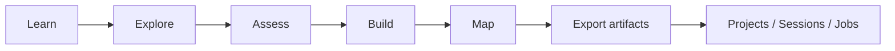
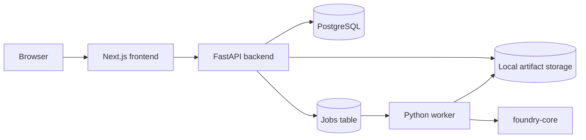
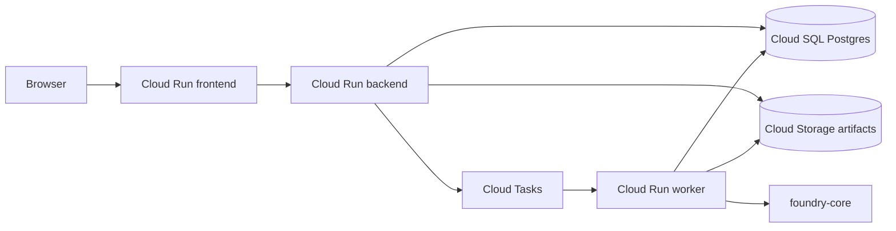

# GCP Quantum Foundry

> A visual-first quantum launchpad for learning, assessing, and prototyping hybrid quantum-classical workflows on Google Cloud.

**From "What is a qubit?" to "How would this run on GCP?" in one guided journey.**

Quantum products often start with code, jargon, or hardware access. **GCP Quantum Foundry** starts with intuition. It helps PMs, architects, technical buyers, and developers understand where quantum fits, explore realistic use cases, prototype toy circuits, and map the result to a hybrid cloud architecture.

```text
Learn -> Explore -> Assess -> Build -> Map
```

## Why this project exists

Quantum computing has a product problem as much as a physics problem.

Most teams do not need another low-level circuit sandbox. They need a way to:

- understand the core ideas without getting buried in math
- see where quantum might matter in the real world
- separate credible prototypes from hype
- generate a hybrid workflow that makes sense on cloud infrastructure
- leave with artifacts they can discuss with engineers, partners, or leadership

**GCP Quantum Foundry** is built for that gap.

It is not just a demo. It is a **productized learning + assessment + prototyping workspace** for credible quantum exploration.

## What makes it different

### 1. It starts with intuition, not code

The experience begins with approachable quantum concepts and visual learning surfaces, then gradually adds industry context, readiness assessment, circuits, and cloud architecture.

### 2. It is honest about where the market is today

The app is **simulation-first**. It does not pretend every workload is ready for quantum hardware or claim quantum advantage by default.

### 3. It is built around hybrid workflows

Instead of treating quantum as an isolated black box, the app shows how data, classical compute, simulation, and post-processing fit together on a real cloud stack.

### 4. It produces artifacts, not just UI moments

Users can generate and save:

- Cirq code
- assessment JSON
- architecture JSON
- session summaries
- persisted projects, sessions, and job history

### 5. It is product-minded, not just research-minded

This repo is designed for local iteration today and a clear hosted path tomorrow.

## Who this is for

- **Product managers** exploring how to explain quantum credibly
- **Solutions architects** who want a hybrid-cloud view, not just a circuit editor
- **Technical sellers / field teams** who need a customer-friendly demo
- **Developers** who want to move from concept to toy prototype quickly
- **Leaders** who want to understand where quantum may become strategically relevant

## What you can do in the app

### Learn

A concept-first landing experience that explains quantum computing in approachable language and gives users a visual starting point.

### Explore

An industry atlas with seeded use cases across areas such as batteries, materials, logistics, and finance.

### Assess

A live **QALS-lite** workspace that provides a transparent readiness heuristic, assumptions, and next-step guidance.

### Build

A **Hybrid Lab** where users can:

- choose a starter lane
- generate a toy circuit
- inspect the explanation
- export Cirq code
- run synchronously
- queue a worker-backed run

### Map

A live architecture mapper that turns a circuit run into a hybrid GCP workflow with exportable artifacts.

### Save

Persist projects, sessions, and background jobs so the app feels like a real workspace, not a one-off demo.

## Product journey



## Accessing the application

### Local access

1. Copy the environment file.

```bash
cp .env.example .env
```

2. Start the full stack.

```bash
make up
```

3. Run database migrations.

```bash
make migrate
```

4. Open the app in your browser.

- Frontend: [http://localhost:3000](http://localhost:3000)
- Explore: [http://localhost:3000/explore](http://localhost:3000/explore)
- Assess: [http://localhost:3000/assess](http://localhost:3000/assess)
- Build: [http://localhost:3000/build](http://localhost:3000/build)
- Map: [http://localhost:3000/map](http://localhost:3000/map)
- Projects: [http://localhost:3000/projects](http://localhost:3000/projects)
- Sessions: [http://localhost:3000/sessions](http://localhost:3000/sessions)
- Jobs: [http://localhost:3000/jobs](http://localhost:3000/jobs)
- Backend docs: [http://localhost:8000/docs](http://localhost:8000/docs)
- Health check: [http://localhost:8000/health](http://localhost:8000/health)

### GCP access

This repo is set up to deploy with Cloud Build to:

- Cloud Run frontend
- Cloud Run backend
- Cloud Run worker
- Cloud SQL
- Cloud Storage
- Cloud Tasks

Deploy using the guide in [docs/gcp-cloud-build.md](/Users/nikhiljethava/Documents/Codex/quantum-computing/docs/gcp-cloud-build.md).

After deployment, Cloud Build prints the **Frontend URL**, **Backend URL**, and **Worker URL** at the end of the build.

If you want to retrieve them later, use:

```bash
gcloud run services describe quantum-foundry-frontend \
  --region=YOUR_REGION \
  --format='value(status.url)'
```

```bash
gcloud run services describe quantum-foundry-backend \
  --region=YOUR_REGION \
  --format='value(status.url)'
```

Open the frontend URL in your browser. Once the app is live, these hosted routes are the main entry points:

- `/` for Learn
- `/explore` for the Industry Atlas
- `/assess` for the QALS-lite workspace
- `/build` for the Hybrid Lab
- `/map` for architecture mapping
- `/projects` for saved projects
- `/sessions` for saved sessions
- `/jobs` for worker activity

Open `${BACKEND_URL}/docs` for the FastAPI docs and `${BACKEND_URL}/health` for the backend health check.

## A 5-minute walkthrough

1. Open **Learn** at `http://localhost:3000/` or the deployed frontend root.
2. Move to **Explore** and filter by batteries, materials, logistics, or finance.
3. Launch **Assess** and show the QALS-lite output.
4. Open **Build** and try a starter lane such as **Bell state**, **Grover**, **routing optimization**, or **chemistry placeholder**.
5. Click **Run in worker** to demonstrate async execution.
6. Open **Map** to show the hybrid split between classical prep, quantum simulation, and post-processing.
7. Open **Projects**, **Sessions**, and **Jobs** to show saved workspace state and operational visibility.

## Developer workflow

### Python services

```bash
python3.11 -m venv .venv
source .venv/bin/activate
make install-python
```

### Frontend

```bash
make install-frontend
make dev-frontend
```

### Backend

```bash
source .venv/bin/activate
make dev-backend
```

### Worker

```bash
source .venv/bin/activate
make dev-worker
```

## Common commands

- `make up` - start Postgres, backend, worker, and frontend with Docker Compose
- `make down` - stop the local stack
- `make logs` - tail service logs
- `make migrate` - run Alembic migrations
- `make test` - run Python test suites
- `make test-backend` - run backend tests
- `make test-worker` - run worker tests
- `cd apps/frontend && npm run lint` - run frontend lint
- `cd apps/frontend && npm run build -- --webpack` - verify the production build

## Architecture at a glance

### Local-first runtime



### Hosted launch path



## Repository layout

```text
.
├── apps
│   ├── backend
│   ├── frontend
│   └── worker
├── docs
│   ├── api.md
│   ├── architecture.md
│   ├── demo-script.md
│   └── gcp-cloud-build.md
├── packages
│   └── foundry-core
├── .env.example
├── cloudbuild.yaml
├── docker-compose.yml
└── Makefile
```

## Core product surfaces

- `/` - Learn surface with approachable quantum explanations
- `/explore` - Industry atlas with seeded use cases and detail drawers
- `/assess` - Live QALS-lite workspace
- `/build` - Hybrid Lab with circuit generation, runs, and artifacts
- `/map` - Hybrid architecture generation and export
- `/projects` - Saved projects
- `/sessions` - Saved workspace sessions
- `/jobs` - Background worker activity

## Tech stack

- **Frontend:** Next.js App Router
- **Backend:** FastAPI
- **Worker:** Python job worker plus Cloud Run task service
- **Shared core:** `foundry-core`
- **Persistence:** PostgreSQL / Cloud SQL
- **Local orchestration:** Docker Compose + Makefile
- **Quantum workflow:** simulation-first, with Cirq code export and worker-backed runs
- **Hosted GCP path:** Cloud Build + Cloud Run + Cloud SQL + Cloud Storage + Cloud Tasks

## Product guardrails

- **Simulation first** - no real Google quantum hardware is enabled by default
- **QALS-lite is heuristic** - it is a readiness aid, not a claim of quantum advantage
- **Transparent architecture generation** - rule-based in v1 so users can inspect the reasoning
- **Persistent product state** - lives in PostgreSQL, not hidden in agent memory
- **MCP is optional** - useful later for retrieval or enterprise connectors, but not required for the core product

## Best starter lanes for demos

- **Bell state** - fastest way to explain superposition and entanglement
- **Grover** - strong for explaining interference and search intuition
- **Routing optimization** - best enterprise story for hybrid cloud + operations
- **Chemistry placeholder** - useful for honest storytelling without overstating v1 capability

## Why this repo is interesting

This project treats quantum computing as a **product experience**, not just a technical stack.

It connects:

- education
- use-case framing
- readiness assessment
- toy-circuit generation
- async execution
- persistence
- cloud architecture mapping

into one coherent journey.

That makes it useful not only as a demo, but as a model for how enterprise quantum onboarding could actually work.

## Near-term roadmap

- richer visualizations in Learn and Build
- stronger seeded use cases and industry narratives
- improved artifact exports for customer handoff
- deeper Cloud Run operational polish and launch automation
- optional retrieval and enterprise connectors through MCP

## Notes

- The app is intentionally **local-first** today.
- The v1 execution model is intentionally **simulation-first**.
- Real hardware access remains a future, configuration-gated path.

If you are exploring how quantum products should feel for real users, not just researchers, this repo is the point.
