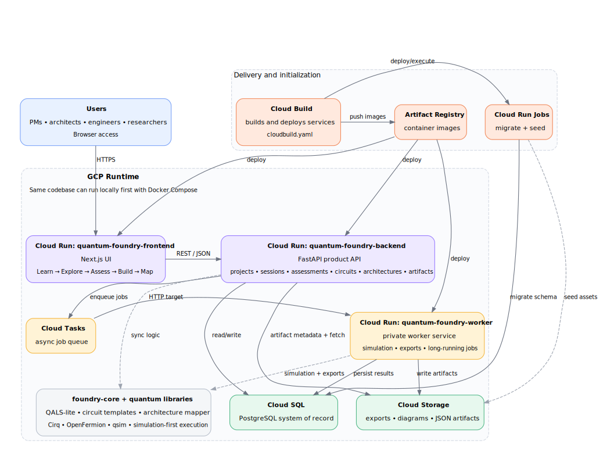

# GCP Quantum Foundry

<p align="center">
  <strong>A visual-first quantum launchpad for learning, assessing, and prototyping hybrid quantum-classical workflows on Google Cloud.</strong>
</p>

<p align="center">
  From <em>"what is a qubit?"</em> to <em>"how would this run on GCP?"</em> in one guided journey.
</p>

<p align="center">
  
  
  
  
  
</p>

---

## Why this project exists

Quantum computing is still difficult to approach for most product teams, architects, and enterprise customers.

Most tools start too deep in the stack: circuits, gates, SDKs, or hardware access.  
**GCP Quantum Foundry** starts somewhere more useful:

- **Learn** the core concepts visually
- **Explore** industry use cases and hybrid patterns
- **Assess** whether an idea is a plausible quantum candidate
- **Build** a toy circuit or prototype path
- **Map** the workload to a real Google Cloud architecture

The product is designed to make quantum computing feel less like an isolated research topic and more like a **hybrid cloud workload**.

---

## The guided journey

```text
Learn → Explore → Assess → Build → Map
```

### Learn
A concept-first surface for understanding qubits, superposition, entanglement, noise, and where quantum fits relative to classical computing.

### Explore
An industry atlas that helps users discover use cases across chemistry, batteries, logistics, finance, and AI/ML research.

### Assess
A live **QALS-lite** workspace that estimates readiness, time horizon, and hybrid fit with transparent assumptions.

### Build
A prompt-to-circuit workspace that generates toy circuits, runs simulations, and produces developer-friendly artifacts.

### Map
A hybrid architecture mapper that shows how the workflow would run across Google Cloud services.

---

## Architecture

<p align="center">
  
</p>

### What the diagram shows

- **Frontend**: a Cloud Run-hosted Next.js app for the full product experience
- **Backend**: a FastAPI service for projects, sessions, assessments, circuits, architectures, artifacts, and job orchestration
- **Worker**: a private Cloud Run worker for asynchronous simulations, exports, and long-running tasks
- **State layer**: Cloud SQL for structured persistence and Cloud Storage for artifacts
- **Async orchestration**: Cloud Tasks triggers the worker through an authenticated HTTP target
- **Core logic**: shared `foundry-core` modules power QALS-lite, circuit templates, architecture mapping, and simulation-first quantum workflows
- **Delivery path**: Cloud Build, Artifact Registry, and Cloud Run Jobs handle build, deploy, migration, and seeding

---

## What makes this app different

### 1. It starts with intuition, not with a blank code editor
The first-run experience is designed for people who are quantum-curious, not just for people who already know the stack.

### 2. It is simulation-first by design
This repo does **not** assume direct access to production QPUs. It focuses on credible learning, realistic readiness assessment, and hybrid prototyping.

### 3. It treats quantum as a hybrid cloud workflow
Instead of positioning quantum as a standalone black box, the app shows how classical preprocessing, quantum kernels, and post-processing work together on GCP.

### 4. It creates artifacts, not just answers
The app is built to generate assessments, diagrams, starter code, exports, and prototype-ready workflows.

---

## Core product surfaces

| Surface | Purpose |
|---|---|
| `/` | Learn surface with approachable quantum concepts |
| `/explore` | Industry atlas and use-case gallery |
| `/assess` | QALS-lite readiness workspace |
| `/build` | Hybrid Lab for prompt-to-circuit and simulation |
| `/map` | Architecture mapper |
| `/projects` | Saved projects |
| `/sessions` | Saved sessions |
| `/jobs` | Worker activity and job status |
| `:8000/docs` | FastAPI API docs |

---

## Local quick start

```bash
cp .env.example .env
make up
make migrate
```

Then open:

- Frontend: `http://localhost:3000`
- Backend docs: `http://localhost:8000/docs`
- Health check: `http://localhost:8000/health`

---

## Repo layout

```text
.
├── apps
│   ├── backend
│   ├── frontend
│   └── worker
├── docs
│   ├── api.md
│   ├── architecture.md
│   ├── demo-script.md
│   └── images
├── packages
│   └── foundry-core
├── cloudbuild.yaml
├── docker-compose.yml
└── Makefile
```

---

## GCP deployment model

This repo is already structured for a clean Google Cloud path:

- `quantum-foundry-frontend` → **Cloud Run** public frontend
- `quantum-foundry-backend` → **Cloud Run** public API
- `quantum-foundry-worker` → **Cloud Run** private worker
- PostgreSQL → **Cloud SQL**
- artifacts and exports → **Cloud Storage**
- async jobs → **Cloud Tasks**
- build/deploy pipeline → **Cloud Build + Artifact Registry**
- migration and seed steps → **Cloud Run Jobs**

The included `cloudbuild.yaml` is designed to wire these pieces together.

---

## How to access the app on GCP

### Public app URL
The app should be accessed through the **frontend Cloud Run service**:

```bash
gcloud run services describe quantum-foundry-frontend \
  --region us-central1 \
  --format='value(status.url)'
```

That command returns the live public URL for the app. Open that URL in your browser.

### Public API URL
If you need the backend endpoint:

```bash
gcloud run services describe quantum-foundry-backend \
  --region us-central1 \
  --format='value(status.url)'
```

You can use the returned backend URL for:

- `${BACKEND_URL}/docs` for FastAPI API docs
- `${BACKEND_URL}/health` for the backend health check

### Private worker URL
The worker is not a user-facing endpoint. It is intended to be invoked by Cloud Tasks.

```bash
gcloud run services describe quantum-foundry-worker \
  --region us-central1 \
  --format='value(status.url)'
```

### Hosted app routes
Once you open the frontend Cloud Run URL, the main hosted routes are:

- `/` for Learn
- `/explore` for the Industry Atlas
- `/assess` for the QALS-lite workspace
- `/build` for the Hybrid Lab
- `/map` for the architecture mapper
- `/projects` for saved projects
- `/sessions` for saved sessions
- `/jobs` for worker activity

---

## Recommended production URL

For an internal or demo deployment, the default Cloud Run URL is fine.

For a stronger production-facing experience, map the frontend to a custom domain such as:

- `https://foundry.<your-domain>.com`
- `https://quantum.<your-domain>.com`
- `https://quantum-foundry.<your-domain>.com`

Recommended pattern:

- public traffic → custom domain → frontend Cloud Run service
- frontend → backend via configured API URL
- backend → worker through Cloud Tasks + authenticated Cloud Run invocation

---

## Product guardrails

- **Simulation first**: no real Google quantum hardware is enabled by default
- **QALS-lite is a heuristic**: it is a readiness aid, not a claim of quantum advantage
- **One guide, one workspace**: the visible experience should feel cohesive, not like a generic multi-agent chatbot
- **MCP remains optional**: connectors and retrieval adapters should not become the core product dependency

---

## Why this matters

GCP Quantum Foundry is not just a toy demo.

It is a product-shaped answer to a real gap in the market:

- make quantum understandable to a broader audience
- help teams identify plausible use cases earlier
- connect quantum curiosity to hybrid cloud architecture
- create a more natural on-ramp into Google Cloud services

If the future of enterprise quantum is hybrid, visual, and guided, this is what that front door can look like.
