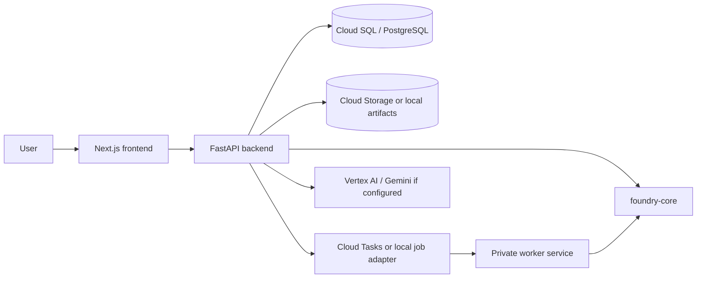

# Architecture

Quantum Foundry is an independent personal project and is not an official Google product.

Quantum Foundry is licensed under Apache-2.0. See the root [LICENSE](../LICENSE) file.

## Status

- **Implemented**: Next.js frontend, FastAPI backend, worker package, shared foundry-core package, PostgreSQL models, local artifact storage, Cloud Run deployment pipeline, Cloud Tasks abstraction, and Google Cloud storage/task adapters.
- **Partially implemented**: Worker-backed jobs and exports depend on deployment configuration. Vertex AI/Gemini guide behavior is configuration-gated.
- **Planned**: Production auth, richer observability, persistent learning profiles, and any approved-access hardware integration.

## High-Level Shape

Quantum Foundry is a monorepo with separate app surfaces and shared Python domain logic.

## Frontend

The frontend lives in `apps/frontend` and uses the Next.js App Router. Public pages provide the visible journey:

- `/` for the curiosity-first article companion, primer entry, Explore entry, and returning-user continuation.
- `/learn` and lesson routes for structured learning.
- `/explore` and `/use-cases/[slug]` for scenario discovery.
- `/assess` for readiness recommendations.
- `/build` for explicit Tutorial and Contract modes in the Algorithm Experiment Workspace.
- `/map` for contract-specific workflow mapping and trust context.
- `/projects`, `/sessions`, and `/jobs` for saved workspace and worker state.

Server-rendered wrappers are used where public explanatory content should be visible in HTML. Client components preserve API-driven interactivity.

## Backend

The backend lives in `apps/backend` and exposes a FastAPI application under `/api/v1`. It handles:

- Product state for projects, sessions, use cases, assessments, circuit runs, architecture records, artifacts, jobs, and page usage.
- Synchronous circuit generation and simulation requests.
- Rule-based readiness and architecture mapping.
- Artifact generation and download.
- Local or configured guide responses.

The backend uses Pydantic schemas for API contracts and SQLAlchemy models for persistence.

## Worker

The worker lives in `apps/worker`. It processes queued work such as background simulations and export generation. In local development, jobs can use the local adapter. In deployment, Cloud Tasks can invoke the private worker service.

The worker is intentionally separate from the interactive frontend so longer-running tasks do not block the user interface.

## foundry-core

The shared package lives in `packages/foundry-core`. It contains reusable logic for:

- Cirq circuit templates.
- Circuit inspection and simulation helpers.
- Optional qsim fallback behavior when `qsimcirq` is installed.
- QALS 3.0 deterministic Algorithm Contract rules plus a legacy internal tutorial-preview compatibility helper.
- Google Cloud architecture mapping rules.
- Storage and job adapter interfaces.

No non-Google quantum SDK is a primary export path.

## Database

PostgreSQL stores product state. The main domain records include:

- `Project`
- `Session`
- `UseCase`
- `Assessment`
- `CircuitRun`
- `ArchitectureRecord`
- `Artifact`
- `Job`
- `PageUsage`

Alembic migrations live under the backend package and should be run before a deployment that depends on schema changes.

## Artifact Storage

Artifacts include Cirq code, assessment JSON, architecture JSON, session summaries, Colab notebooks, and worker outputs. Contract-backed artifacts persist nullable assessment/contract references and Result Trust context; exported content also carries the declared baseline, horizon, assumptions, and labels.

- **Local development**: filesystem-backed artifact storage.
- **Deployment**: Cloud Storage can be used through the storage adapter.

## Job Orchestration

The job abstraction supports local and Cloud Tasks-backed execution.

- The API creates `Job` records and dispatches work.
- The worker updates job status and stores results.
- Supported statuses include queued/pending, running, completed, and failed depending on the execution path.

## Circuit Simulation Flow

1. The user selects a starter circuit or requests a lab run.
2. The frontend calls `POST /api/v1/circuits/run`.
3. The backend uses foundry-core to build a Cirq circuit.
4. The simulator runs locally in process for synchronous requests.
5. The backend stores a `CircuitRun` record with histogram, code, explanation, metrics, and metadata.
6. The frontend renders the circuit canvas, code, metrics, histogram, and optional state/noise views.

Circuit results are educational unless separately validated.

## Assessment And Contract Flow

1. The user chooses a use case or starter context.
2. The frontend submits assumptions to `POST /api/v1/assessments`.
3. The backend runs QALS 3.0 deterministic rules against the supplied evidence and assumptions.
4. The API returns the verdict, confidence, time horizon, contract reduction, baseline status,
   missing evidence, caveats, build eligibility, trust labels, and backward-compatible score fields.
5. Serious Build work creates a persisted Algorithm Contract and Experiment Bundle. The backend
   blocks invalid and tutorial-only contracts from creating a serious bundle.
6. A compute simulation is queued only when required contract inputs are complete. The worker
   resolves matching assessment, contract, and bundle rows and rechecks QALS eligibility plus the
   declared baseline before circuit creation. PQC remains a non-compute migration action.

QALS 3.0 is not an ML model, advantage predictor, probability of success, or guaranteed ROI score.

## Architecture Mapping Flow

1. The user maps a circuit run, assessment, or use case.
2. The frontend calls `POST /api/v1/architectures` with assessment and contract context when available.
3. The backend selects optimization, chemistry/materials, search, PQC, or tutorial mapping rules.
4. Each node is labeled classical, simulated quantum, optional approved hardware, or future-only.
5. PQC maps are classical migration paths and contain no circuit or QPU node.
6. Persisted maps retain trust context and can be exported as JSON or summarized in an artifact.

## Result Trust Flow

The additive Result Trust representation is shared by assessments, circuit runs, Experiment Bundles,
architecture maps, Saved details, and export previews. It includes evidence category, backend and
execution status, simulation metrics where applicable, baseline and contract status, verdict,
confidence, horizon, labels, assumptions, missing evidence, caveats, provenance, timestamp, and
software/version context. It is not QCVV or hardware characterization. Generic educational noise is
never described as calibrated hardware noise.

## Deployment Overview

The first hosted target is Cloud Run:

- Frontend service: public Next.js service.
- Backend service: public FastAPI API service.
- Worker service: private worker service.
- Database: Cloud SQL for PostgreSQL.
- Artifacts: Cloud Storage.
- Queue: Cloud Tasks.
- Build/deploy: Cloud Build and Artifact Registry.

Google quantum hardware access is restricted to approved groups. Quantum Foundry is simulation-first unless approved access is configured.

## Current Limitations

- No production auth is implemented in this release-hardening pass.
- Direct Cloud Run traffic does not provide city-level analytics headers by default.
- Edited-circuit execution is not a full arbitrary-circuit compiler.
- qsim and Vertex AI/Gemini features are optional/configuration-gated.
