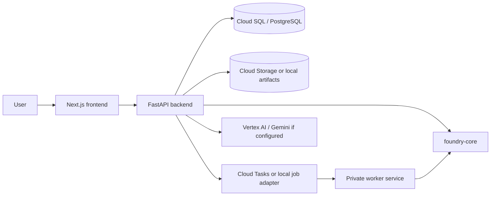

# Architecture

Quantum Foundry is an independent personal project and is not an official Google product.

Quantum Foundry is licensed under Apache-2.0. See the root [LICENSE](../LICENSE) file.

## Status

- **Implemented**: Next.js frontend, FastAPI backend, worker package, shared foundry-core package, PostgreSQL models, local artifact storage, Cloud Run deployment pipeline, Cloud Tasks abstraction, and Google Cloud storage/task adapters.
- **Partially implemented**: Worker-backed jobs and exports depend on deployment configuration. Vertex AI/Gemini guide behavior is configuration-gated.
- **Planned**: Production auth, richer observability, persistent learning profiles, and any approved-access hardware integration.

## High-Level Shape

Quantum Foundry is a monorepo with separate app surfaces and shared Python domain logic.

## Frontend

The frontend lives in `apps/frontend` and uses the Next.js App Router. Public pages provide the visible journey:

- `/` for the product introduction.
- `/learn` and lesson routes for structured learning.
- `/explore` and `/use-cases/[slug]` for scenario discovery.
- `/assess` for readiness recommendations.
- `/build` for the Cirq Lab.
- `/map` for workflow mapping.
- `/projects`, `/sessions`, and `/jobs` for saved workspace and worker state.

Server-rendered wrappers are used where public explanatory content should be visible in HTML. Client components preserve API-driven interactivity.

## Backend

The backend lives in `apps/backend` and exposes a FastAPI application under `/api/v1`. It handles:

- Product state for projects, sessions, use cases, assessments, circuit runs, architecture records, artifacts, jobs, and page usage.
- Synchronous circuit generation and simulation requests.
- Rule-based readiness and architecture mapping.
- Artifact generation and download.
- Local or configured guide responses.

The backend uses Pydantic schemas for API contracts and SQLAlchemy models for persistence.

## Worker

The worker lives in `apps/worker`. It processes queued work such as background simulations and export generation. In local development, jobs can use the local adapter. In deployment, Cloud Tasks can invoke the private worker service.

The worker is intentionally separate from the interactive frontend so longer-running tasks do not block the user interface.

## foundry-core

The shared package lives in `packages/foundry-core`. It contains reusable logic for:

- Cirq circuit templates.
- Circuit inspection and simulation helpers.
- Optional qsim fallback behavior when `qsimcirq` is installed.
- QALS-lite assessment heuristics.
- Google Cloud architecture mapping rules.
- Storage and job adapter interfaces.

No non-Google quantum SDK is a primary export path.

## Database

PostgreSQL stores product state. The main domain records include:

- `Project`
- `Session`
- `UseCase`
- `Assessment`
- `CircuitRun`
- `ArchitectureRecord`
- `Artifact`
- `Job`
- `PageUsage`

Alembic migrations live under the backend package and should be run before a deployment that depends on schema changes.

## Artifact Storage

Artifacts include Cirq code, assessment JSON, architecture JSON, session summaries, Colab notebooks, and worker outputs.

- **Local development**: filesystem-backed artifact storage.
- **Deployment**: Cloud Storage can be used through the storage adapter.

## Job Orchestration

The job abstraction supports local and Cloud Tasks-backed execution.

- The API creates `Job` records and dispatches work.
- The worker updates job status and stores results.
- Supported statuses include queued/pending, running, completed, and failed depending on the execution path.

## Circuit Simulation Flow

1. The user selects a starter circuit or requests a lab run.
2. The frontend calls `POST /api/v1/circuits/run`.
3. The backend uses foundry-core to build a Cirq circuit.
4. The simulator runs locally in process for synchronous requests.
5. The backend stores a `CircuitRun` record with histogram, code, explanation, metrics, and metadata.
6. The frontend renders the circuit canvas, code, metrics, histogram, and optional state/noise views.

Circuit results are educational unless separately validated.

## Assessment Flow

1. The user chooses a use case or starter context.
2. The frontend submits assumptions to `POST /api/v1/assessments`.
3. The backend runs QALS-lite heuristics.
4. The API returns a recommendation, blockers, promising signals, next 90 days, and the backward-compatible score fields.

QALS-lite is a readiness heuristic, not a scientific proof.

## Architecture Mapping Flow

1. The user maps a circuit run, assessment, or use case.
2. The frontend calls `POST /api/v1/architectures`.
3. The backend generates a rule-based simulator-first workflow.
4. The result can be persisted and exported as JSON or summarized in a session artifact.

## Deployment Overview

The first hosted target is Cloud Run:

- Frontend service: public Next.js service.
- Backend service: public FastAPI API service.
- Worker service: private worker service.
- Database: Cloud SQL for PostgreSQL.
- Artifacts: Cloud Storage.
- Queue: Cloud Tasks.
- Build/deploy: Cloud Build and Artifact Registry.

Google quantum hardware access is restricted to approved groups. Quantum Foundry is simulation-first unless approved access is configured.

## Current Limitations

- No production auth is implemented in this release-hardening pass.
- Direct Cloud Run traffic does not provide city-level analytics headers by default.
- Edited-circuit execution is not a full arbitrary-circuit compiler.
- qsim and Vertex AI/Gemini features are optional/configuration-gated.
