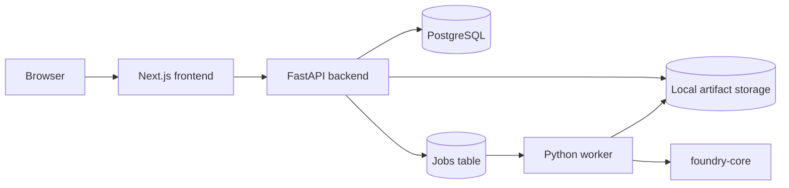
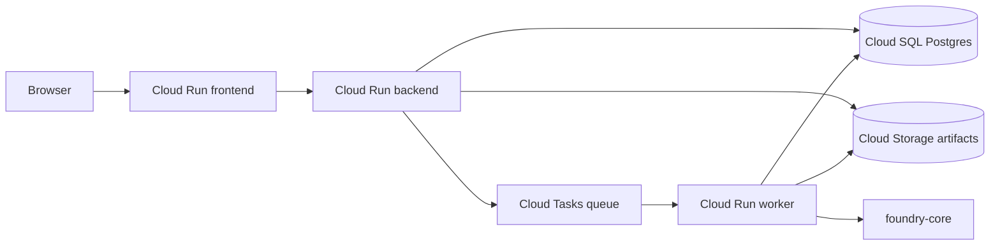
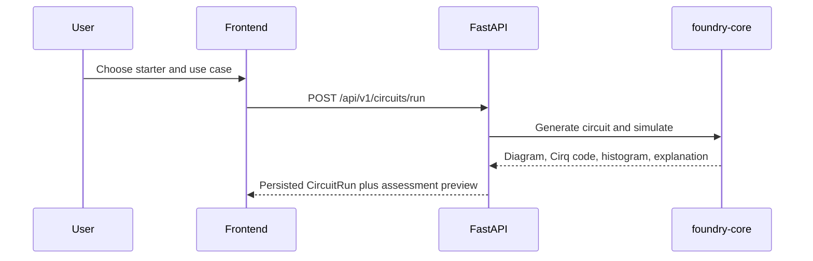
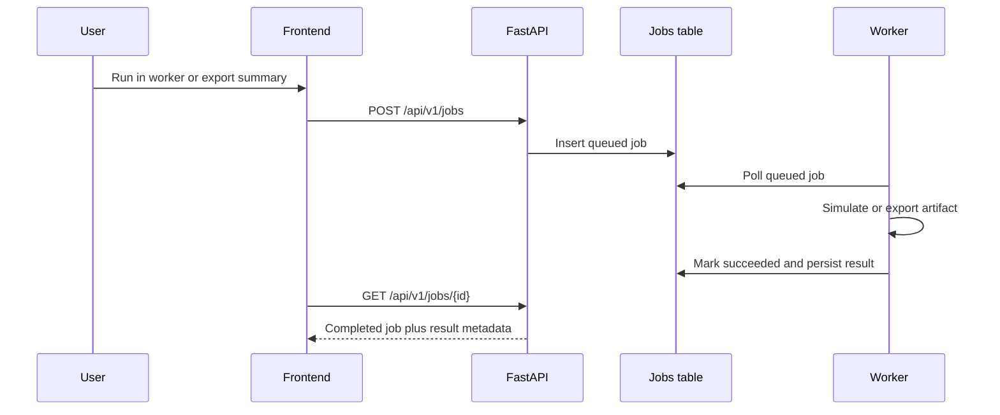

# GCP Quantum Foundry Architecture

## Product shape

GCP Quantum Foundry is a local-first interactive launchpad for PMs, architects,
and technical buyers exploring credible quantum and hybrid-cloud prototypes.
The product flow is:

`Learn -> Explore -> Assess -> Build -> Map`

The app is intentionally simulation-first. Real hardware remains behind future
configuration gates, and the visible product is a guided workspace rather than a
generic chatbot shell.

## Runtime components

- `apps/frontend`
  Next.js application for Learn, Explore, Assess, Build, Map, Projects,
  Sessions, and Jobs.
- `apps/backend`
  FastAPI API for persistence, orchestration, assessments, architectures,
  circuits, exports, and workspace state.
- `apps/worker`
  Python worker for async simulation runs and artifact generation.
- `packages/foundry-core`
  Shared deterministic package for circuit templates, simulation adapters,
  explainers, readiness scoring, architecture mapping, storage, and queue
  abstractions.

## Core domain

- `Project`
  Top-level container for demos, customer narratives, and saved workspace
  history.
- `Session`
  Persistent workspace snapshot that binds starter lane, selected use case,
  latest run, latest architecture, and exported artifacts.
- `UseCase`
  Seeded industry atlas entry with problem framing, maturity horizon, and
  quantum angle.
- `Assessment`
  Deterministic QALS-lite readiness output.
- `CircuitRun`
  Persisted simulation result with Cirq code, histogram, explanation, and
  assessment preview.
- `ArchitectureMap`
  Persisted hybrid GCP architecture tied to a circuit run.
- `Artifact`
  Downloadable export such as Cirq code, assessment JSON, architecture JSON, or
  session summary.
- `Job`
  Queue-backed async work item for worker-managed simulation or export flows.

## Runtime flow

## Cloud Run launch shape

## Product flows

### Synchronous build flow

### Worker-backed flow

## Design choices

- Product state lives in PostgreSQL, not in agent memory.
- The interactive workspace supports both synchronous runs for fast feedback and
  worker-backed runs for longer operations.
- Simulation is the default execution mode everywhere in v1.
- Real hardware remains behind future configuration gates.
- QALS-lite stays explainable and deterministic in v1.
- Architecture generation is rule-based in v1 so it remains transparent.

## MCP stance

- MCP is optional.
- The best early MCP use cases are retrieval and enterprise connectors.
- Core product logic keeps working without MCP:
  assessment, circuit generation, simulation, and architecture mapping stay
  local and testable.

## Current user-facing surfaces

- `/`
  Learn surface with primer content and concept-first entry points.
- `/explore`
  Industry atlas with use-case detail, assessment launch, and Build handoff.
- `/assess`
  Live QALS-lite screen with transparent assumptions and next-action guidance.
- `/build`
  Hybrid Lab with live circuit generation, worker-backed runs, artifacts, and
  workspace persistence.
- `/map`
  Live architecture view with downloadable JSON export.
- `/projects`, `/sessions`, `/jobs`
  Saved work and background activity surfaces.

## Future GCP path

- Deploy `apps/frontend`, `apps/backend`, and `apps/worker` to Cloud Run.
- Move PostgreSQL to Cloud SQL.
- Use the storage adapter to switch from local artifacts to Cloud Storage.
- Use the job adapter to switch from the local polling loop to Cloud Tasks with
  a Cloud Run worker endpoint.
- Add auth adapters for internal preview later, not during the local MVP.
