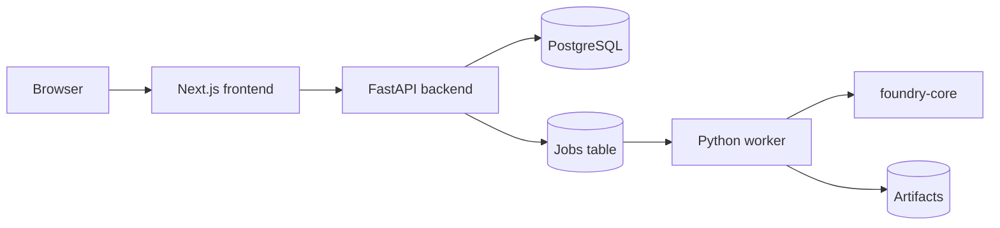

# GCP Quantum Foundry Architecture

## Local-first shape

This repository is a local-first scaffold for GCP Quantum Foundry. The goal is
to keep the product honest, easy to run, and cleanly decomposed before any
deeper GCP platform work begins.

## Runtime components

- `apps/frontend`
  Next.js application for the Learn, Explore, Assess, Build, and Map journey.
- `apps/backend`
  FastAPI product API for persistence, read models, orchestration, and exports.
- `apps/worker`
  Python worker for async simulation and artifact generation.
- `packages/foundry-core`
  Shared package for deterministic assessment heuristics, circuit generation,
  simulation adapters, explainers, mapping, storage, and queue abstractions.

## Local runtime flow

## Design choices

- Product state lives in PostgreSQL, not in agent memory.
- Long-running work happens through the worker path, not synchronous API calls.
- Simulation is the default execution mode.
- Real hardware remains behind future configuration gates.
- QALS-lite stays explainable and deterministic in v1.

## MCP stance

- MCP is optional.
- The best early MCP use cases are retrieval and enterprise connectors.
- Core product logic should keep working without MCP:
  assessment, circuit generation, simulation, and architecture mapping stay
  local and testable.

## Future GCP path

- Deploy `apps/frontend`, `apps/backend`, and `apps/worker` to Cloud Run.
- Move PostgreSQL to Cloud SQL.
- Swap local artifact storage for Cloud Storage through a storage adapter.
- Swap the local polling worker path for Cloud Tasks or a queue-backed Cloud Run
  handler through a queue adapter.
- Add auth adapters for internal preview later, not during the local MVP.
