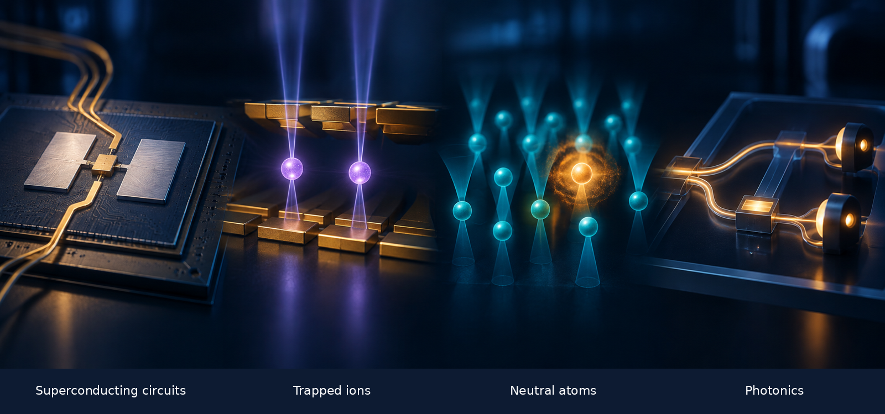
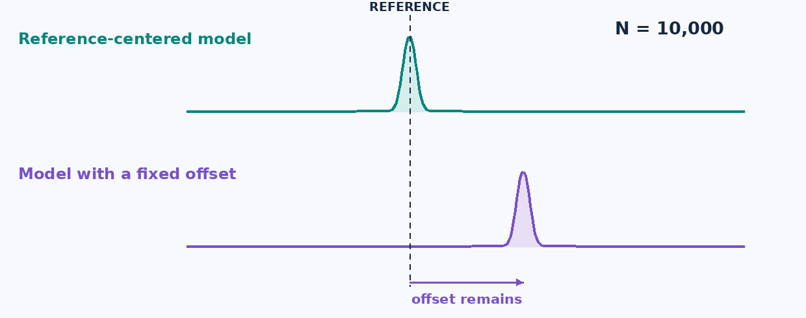
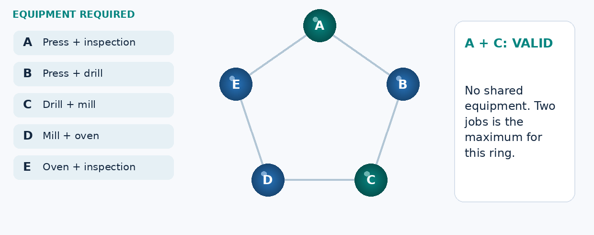
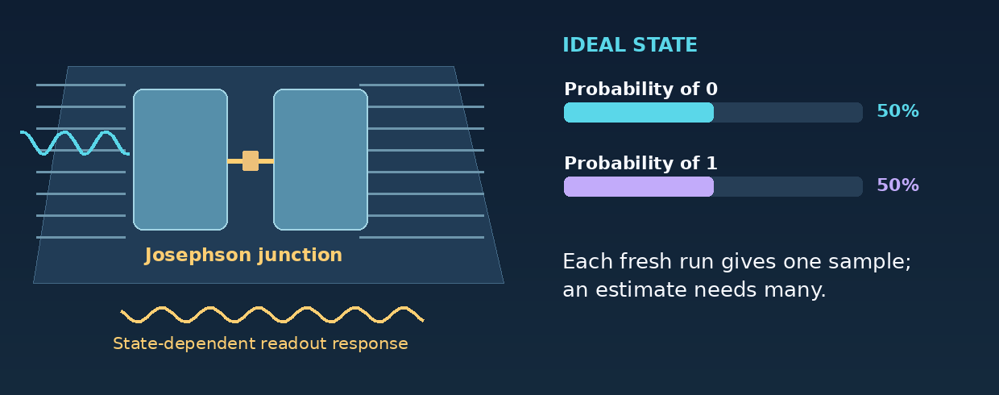
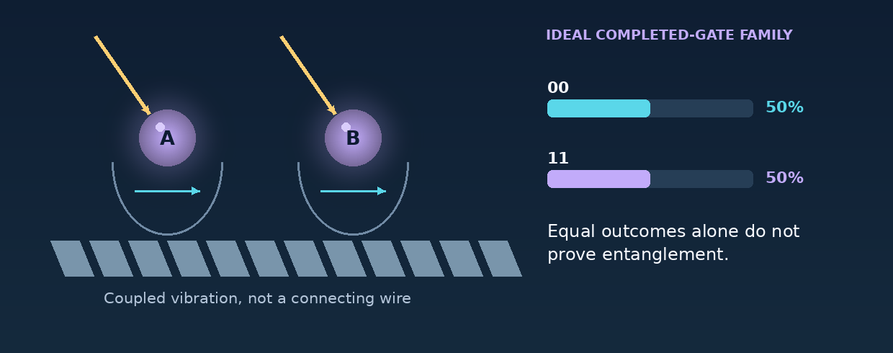
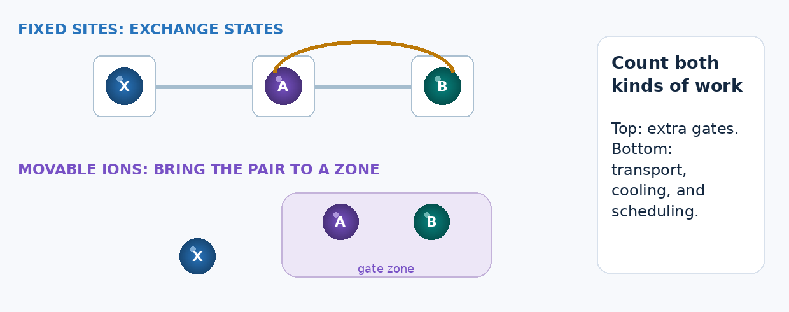
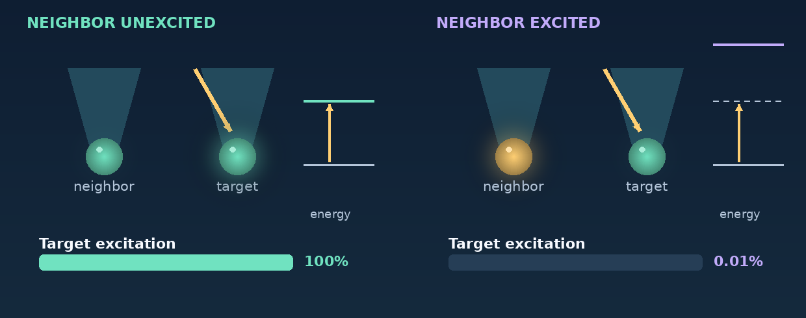
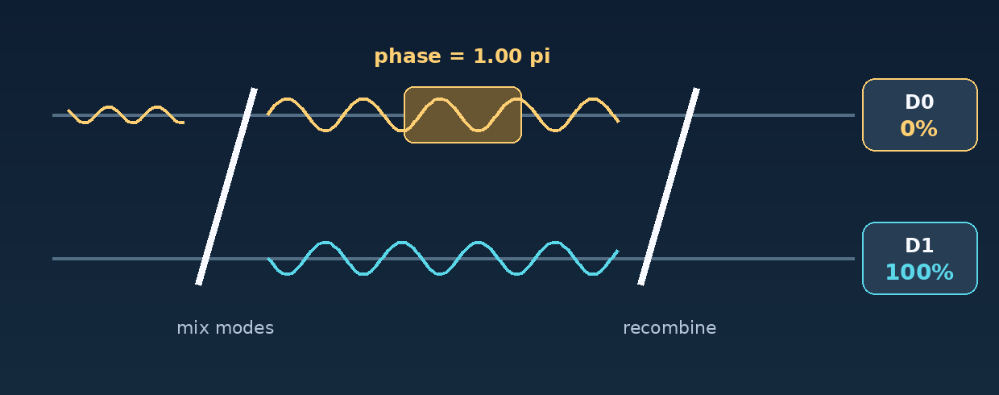
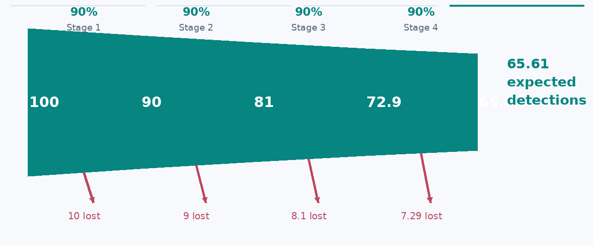
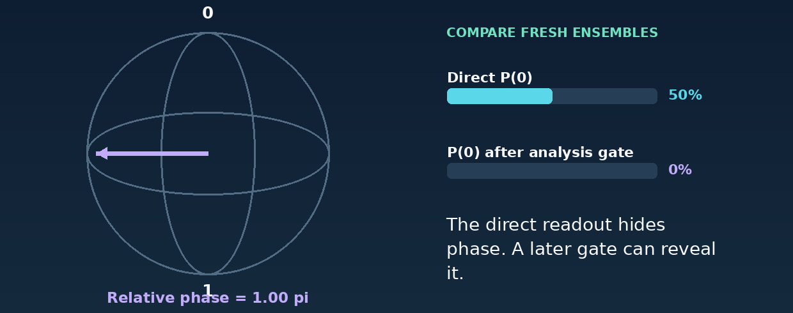

<!-- Mechanical extraction of the supplied DOCX; not a replacement implementation brief. -->

# There Is No Single Winning Qubit Technology

A practical guide to the machines—and the work each is worth testing

Beyond the Quantum Processor · Article 4 · Version 9

A chemistry team wants to decide which catalyst to test next. A factory planner wants to fit more jobs into a shift without double-booking equipment. Both may be interested in quantum computing. But they need different answers, and those answers may require different machines.

That is the starting point for this article. I would choose quantum hardware by the calculation it needs to perform, not by its most impressive specification. A fast gate helps only if the complete experiment delivers an accurate answer sooner. Flexible connections help only if they save more work than they introduce elsewhere.

This does not mean all technologies are equally capable, or that none can eventually lead an important market. It means that a qubit count or a single gate measurement cannot establish a winner for every task. To make a useful choice, we need to follow the problem into the machine.

AI-generated editorial concept art, not a hardware schematic. Mechanism diagrams below are separately drawn teaching models.

Level 100 — Read the main article. Start with the two examples, scan the comparison table, and follow the four machines. The short steps and “My take” passages carry the argument.

Level 400 — Open the technical companion. It retains the equations, algorithm differences, error models, and research evidence. You can skip it without losing the story. The animations are deliberately slowed teaching models, not footage or calibrated simulations of quantum hardware.

## 1. What would a useful answer look like?

### Chemistry: choose a better laboratory experiment

A catalyst gives a reaction another route from its starting materials to its products. Researchers study the intermediate structures and the barriers between reaction steps to understand which routes may be promising. Calculating electronic energies can help build that picture. It does not replace the laboratory: temperature, solvent, unwanted reactions, and the catalyst’s lifetime still matter. [1]

The quantum calculation would answer a smaller, precise question: what is the electronic energy of this specified molecular model? Comparing several such calculations may help researchers decide which mechanism or candidate deserves closer investigation. Even an exact solution of a simplified model is not automatically a prediction of industrial performance.

For an early test, I would use a small model with a trustworthy classical reference. One possible method is the Variational Quantum Eigensolver (VQE). A classical program chooses circuit settings; the quantum processor supplies repeated measurements; the classical program estimates an energy and changes the settings. The original VQE experiment used a photonic processor, so chemistry is clearly not owned by one qubit technology. [2]

The practical distinction is between collecting more data and collecting better data:

| What goes wrong? | What more measurements can do |
| --- | --- |
| Too little data: repeated samples give an uncertain estimate. | More independent samples can narrow the statistical uncertainty. |
| A persistent offset: the preparation, operations, readout, or model shift the estimate. | More samples alone do not remove the offset. They can make the wrong answer look more precise. |

Figure 1. The reference and offset are chosen for this lesson. The curves show schematic sample-mean spreads with heights normalized for display, not energies measured on quantum hardware.

The decision: compare the total time and cost needed to reach the required accuracy. Counting shots per second is useful, but only when the resulting measurements support that answer. The technical companion compares VQE with SQD and QPE rather than treating VQE as the only chemistry option.

### Scheduling: choose jobs that can run together

Now consider five jobs, A through E, competing for one time slot. Each needs two pieces of equipment. A and B both need the press, so selecting both is invalid. A and C use different equipment and can run together.

We can express that rule as a graph: one dot per job, and one line for each equipment conflict. We want the largest selection containing no connected pair. This is called a maximum independent set (MIS). In our example the conflicts form a five-job ring, and the largest valid selection contains two jobs.

Figure 2. The same jobs remain visible as equipment requirements become conflicts and then a checked selection. This five-job example is solved classically; it is not a quantum benchmark.

Why bring atoms into this? In one neutral-atom approach, exciting two nearby atoms together is energetically unfavorable. For a suitable arrangement, that interaction can represent the rule “do not select both conflicting jobs.” The hardware can then sample candidate selections, which classical software checks. Published experiments investigate this idea on particular graph families. [3]

There are two tests before calling it useful:

Does the mapping preserve the problem? Real schedules may also include durations, priorities, and setup times. Our five-dot model does not include them.

Does the complete method improve the result? Count mapping, unsuccessful attempts, checking, and total runtime, then compare with a strong classical solver.

The chemistry example asks for accurate estimates from repeated measurements. The scheduling example also asks whether the machine’s interactions represent the right constraints. We now have concrete reasons to compare the hardware.

## 2. Where I would look first

The table gives evaluation starting points, not exclusive applications. Developer names identify examples; they do not imply equivalent products or public access to every research capability.

| Technology and examples | Use cases worth evaluating | The question that decides the fit |
| --- | --- | --- |
| Superconducting circuits — Google Quantum AI; IBM. [8,25] | Repeated circuit experiments; local-interaction models; error-correction research. | Can short operations deliver the required accuracy sooner after routing, measurement, and reset are counted? |
| Trapped ions — Quantinuum; IonQ. [12,26] | Modest-size circuit tests requiring many different qubit pairs to interact, including selected chemistry experiments. | Do fewer extra gates improve the answer enough to justify transport, cooling, and measurement time? |
| Neutral atoms — QuEra; Atom Computing; Pasqal. [27,28,39] | Suitable many-body models and geometric conflict graphs; separately, digital and logical-computing research. | Do the available interactions fit the model without excessive mapping or operating overhead? |
| Photonics — PsiQuantum; Xanadu. [18,19] | Optical processing, modular-system research, and proposed fault-tolerant application machines. | Can the full system supply sufficiently good resources at a useful rate after losses are included? |

A developer can pursue more than one approach. Google announced a neutral-atom research program alongside superconducting work in March 2026. IonQ completed its Oxford Ionics acquisition in September 2025. These organizational facts do not establish a performance comparison. [38,40]

## 3. Four words make the hardware easier to follow

We need a little shared vocabulary before looking inside the machines. The important distinction is between the physical object and the information it holds. Moving an atom is not the same thing as changing its qubit from 0 to 1. [4–7,9]

| Term | What it means here |
| --- | --- |
| Qubit | Information represented using two chosen quantum states, labeled 0 and 1. The device can also be in a superposition of them. |
| Gate | A controlled operation on one or more qubits. A circuit is an ordered collection of these operations. |
| Measurement or readout | The physical process and signal processing that produce recorded outcomes. Repeated fresh runs supply statistics. |
| Logical qubit | Information protected by an encoding and its supporting operations. Its reliability and resource cost depend on the implementation. |

Superposition also involves relative phase: two states can give the same immediate 0/1 probabilities yet respond differently to a later gate. Two qubits can be entangled, meaning their joint state cannot be prepared as separate states, even allowing shared classical randomness. Matching output bits alone do not demonstrate that distinction. Companion B makes both ideas visible with measurement comparisons. [4,5]

## 4. Superconducting circuits: can we collect accurate results sooner?

Return to the molecular experiment. It may need repeated measurements at many circuit settings. Short physical operations can help, provided the full run is accurate and measurement or reset does not dominate the time. That is my reason to include a superconducting implementation—not a general claim that it is best for chemistry.

A common design is the transmon, a tiny electrical circuit operated at very low temperature. A capacitor and a Josephson junction give it a set of quantum energy levels with unequal spacings. Engineers use the lowest two as the qubit. The information is in a collective circuit state, not an individual electron traveling through a wire. [6,7]

### Follow one run

Prepare the starting state. The device is cooled and reset. Cooling the refrigerator does not by itself guarantee perfect qubit preparation.

Apply the operations. Microwave pulses change the state, while designed couplings enable operations between selected qubits. The chip stays in place.

Read the result. A resonator responds differently depending on the qubit state. A probe signal and measurement electronics turn that response into recorded data. [7,29]

Figure 3. One ideal rotation changes a qubit’s measurement probabilities. The pulse and readout sketches are explanatory; they do not model a calibrated transmon or its leakage.

The complication is connectivity. Many transmon chips directly connect selected nearby pairs. When a circuit needs another pair, the compiler may add operations that move their quantum states into a usable arrangement. Those operations take time and may reduce accuracy. Layouts vary; superconducting hardware is not universally one square grid. [7,25]

My take: I would test a superconducting implementation early when the circuit repeats often and most interactions fit the available connections. I would change that preference if added operations or noise prevent it from reaching the energy target, regardless of how fast the individual gates are.

What to request: the implemented circuit, preparation-to-readout time, reset time, achieved energy error, and uncertainty. The question is whether the researcher gets a useful estimate sooner. Companion C explains energy-level selectivity, leakage, and DRAG pulse shaping.

## 5. Trapped ions: can we avoid extra operations?

The same chemistry circuit may ask many different pairs of qubits to interact. A trapped-ion implementation can sometimes do this with fewer routing gates. That could improve the state used for the energy measurement. It does not automatically make the whole experiment faster.

An ion is a charged atom held by electromagnetic fields in a vacuum. Two selected internal states store the qubit. Laser or microwave controls manipulate them. Ions of the same isotope share their intrinsic atomic structure, but differences in local fields, motion, and controls still affect performance. [9]

### Follow a two-qubit operation

Prepare the ions. Trapping and cooling establish the operating conditions, and the internal states are initialized.

Use their shared motion. The ions repel one another, so their vibrations are coupled. A controlled pulse sequence uses that motion to mediate an interaction between the internal qubits.

Finish the sequence and read. The intended gate removes unwanted residual coupling to motion while leaving a joint quantum state. State-dependent fluorescence can then distinguish the chosen readout outcomes. [9,10]

Figure 4. The motion is exaggerated and schematic. The final probabilities correspond to an ideal XX gate. Shared 00/11 outcomes alone are not an entanglement test; Companion B supplies the missing comparison.

Some ion processors use a quantum charge-coupled device (QCCD) layout: ions move between storage and operation zones. This provides flexible access, but transport, cooling, and shared zones must be scheduled. “All-to-all” pair access does not mean all pairs can operate simultaneously at no cost. [11,12]

Figure 5. On top, quantum states exchange places between fixed sites. Below, ions move to an operation zone. The timelines are steps, not matched physical durations or vendor benchmarks.

My take: I would include a well-characterized ion system when extra routing on another machine makes a small or moderate-size circuit too inaccurate. I would accept a longer native gate only if the full experiment still meets the accuracy and time requirements.

What to request: the actual transport and gate schedule, measurement time, permitted parallel operations, and final result quality. Do not convert average gate fidelity directly into the probability that the chemistry answer is correct. Companion D explains the routing arithmetic and its limits.

## 6. Neutral atoms: does the physical interaction match the problem?

The factory example provides a direct reason to examine neutral atoms. Its central rule is that two conflicting jobs must not both be selected. A suitable atom arrangement can make the corresponding pair of excitations costly in energy. The value comes from matching a specific rule—not simply from having a large array.

Focused light creates small traps called optical tweezers. In a representative digital design, relatively stable internal atomic states store the qubit. A laser temporarily excites an atom to a Rydberg state, with a much more extended electron probability distribution and strong interactions with nearby Rydberg excitations. The electron has not escaped. [13,14]

### Follow the conditional response

Tune a pulse to excite the target atom. With its neighbor unexcited, the pulse can match the required transition.

Excite the neighbor instead. The interaction changes the energy required for the target’s excitation.

Apply the same target pulse. It is now off resonance, so excitation is suppressed. This mechanism is called Rydberg blockade. It is not a hard wall or a complete algorithm. [13]

Figure 6. The two panels use the same target pulse. The right-hand energy shift is an assumed eight times the drive scale. Its small residual excitation is allowed by the model; blockade does not mean a mathematically forbidden event.

Two uses of this mechanism need to stay separate:

| Analog conflict-graph experiment | Digital quantum circuit |
| --- | --- |
| Ground/Rydberg occupation represents an unselected/selected job during the computation. Strong pair interactions penalize conflicting selections. | Stable internal states store the qubit. Rydberg excitation is used temporarily in a gate sequence, then information returns to the storage states. |
| Check whether the geometry and controls represent the desired objective, then measure and validate candidate selections. | Evaluate the compiled gates, movements, measurements, and protection just as for other circuit-based machines. |

These are approaches within a hardware family, not features guaranteed by every neutral-atom product. More elaborate graph mappings can require auxiliary atoms. Real interactions also extend beyond the ideal conflict edges. [3,14,15,34]

My take: I would investigate an analog neutral-atom experiment when the model or conflict graph fits the available interactions with limited extra mapping. I would keep a strong classical solver as the reference and change the method if the mapping makes the experiment impractical.

What to request: the atom layout, additional atoms, modeled unwanted interactions, valid-solution rate, solution quality, and total runtime. Replacing a lost atom restores a component, not its unknown quantum state; recovering information requires a suitable encoding. Companion E gives the objective and explains why graph-embedding overhead is not one universal number. [15]

## 7. Photonics: how often does good quantum information arrive?

Photonics needs a slightly different introduction. Its appeal is not that either running example automatically belongs on an optical processor. It is that optical paths and connections offer a way to build and link quantum-computing modules. The application question remains whether the complete architecture can supply the required calculation reliably and economically. [18–21]

For a simple lesson, consider one photon in two possible optical paths. These are the basis states of one path-encoded, or dual-rail, qubit. A beam splitter mixes the path amplitudes without making a second copy of the photon. [16,18]

### Follow the light

Prepare and mix the modes. The input contains one photon; both paths can contribute to its quantum state.

Change their relative phase. A phase shifter changes how the two contributions will combine.

Recombine and detect. Interference changes the probabilities at the output detectors. In an ideal successful trial, one detector clicks. Repeat with fresh photons to estimate the probabilities.

Figure 7. Each phase setting describes fresh preparations of the ideal one-photon state. The traces are amplitudes, not two photons. The diagram explains a single-qubit interferometer, not a universal quantum computer.

A larger photonic computer needs more. Fusion-based designs use joint measurements to connect prepared entangled resources. Other designs encode information in structured optical states known as GKP states. Their state-preparation and error-correction requirements differ. The speed of light does not determine the rate of useful logical operations. [16,17,20]

The reporting distinction is crucial:

| Quality question | Delivery question |
| --- | --- |
| How good were the states or operations in the specified detected subset? | How often did preparation, routing, and detection produce that subset? |
| Report conditional fidelity and the selection rule. | Report attempts, losses, accepted events, and elapsed time. |

Figure 8. Four hypothetical stages each transmit or detect 90% of incoming photons. The expected surviving fraction is 65.61%. This is neither state fidelity nor the success probability of a full photonic algorithm.

My take: I would evaluate photonics for optical processing and modular-computing designs, but require a complete resource-generation and loss budget for a demanding application. A high-fidelity accepted event is important; it is not the same as a high useful-event rate.

What to request: source and resource-state yield, path loss, detector behavior, buffering, feed-forward, and the code-specific error budget. Optical links also connect matter-qubit processors, so networking is not exclusive to all-photonic machines. Companion F separates dual rail, fusion networks, GKP states, and the meaning of a published threshold. [18–21]

## 8. The algorithm changes what to measure

Even one chemistry problem can lead to different hardware requirements. VQE uses an optimizer and repeated energy estimates. Sample-based quantum diagonalization (SQD) uses quantum samples to select configurations for a smaller classical calculation. Quantum phase estimation (QPE) uses controlled evolution to learn an eigenvalue. These are alternatives, not mandatory rungs on a maturity ladder. For optimization, the Quantum Approximate Optimization Algorithm (QAOA) uses an adjustable circuit to sample possible solutions. [1,2,22,36,37]

| Method | What must work well | Compare this—not a headline specification |
| --- | --- | --- |
| VQE | State preparation, measurements, and classical optimization. | Energy error and uncertainty at the full time and cost limit. |
| SQD | Informative samples, useful subspace coverage, and classical diagonalization. | Result quality versus quantum effort and classical solve cost. |
| Digital QAOA | A circuit that samples candidates for an optimization objective. | Feasibility, solution quality, repetitions, and complete runtime. |
| Analog Rydberg MIS | A faithful physical mapping and an effective evolution/readout procedure. | Mapping overhead, valid answers, solution size, and a strong classical comparison. |
| Demanding chemistry QPE | Accurate controlled evolution and sufficient overlap with the desired state. | A full protected implementation: logical operations, failures, runtime, and resource factories. |

SQD does not make state preparation or circuit quality irrelevant. QPE is not intrinsically restricted to fault-tolerant hardware; small demonstrations differ from demanding chemistry proposals. Neither the ability to run an algorithm nor a small successful test establishes application advantage. [1,22,36,37]

## 9. The choice I would actually make

For the catalyst study, I would agree on the molecular model and the accuracy needed for the scientific decision, then compare suitable implementations. The winner of that evaluation is the method that reaches the agreed target within the available time and cost. It could be classical. It need not be the same method for a larger model.

For the factory study, I would first solve the real constraints classically and examine whether a quantum mapping preserves them. I would not let an attractive five-dot illustration substitute for the actual schedule. An experiment is useful when it resolves a genuine uncertainty, not merely when it runs.

For a future fault-tolerant application, I would compare complete logical architectures. Error-correcting codes, measurement, transport, and optical resources can change the hardware choice. A physical-qubit count alone does not describe that calculation. [5,23]

Here is the review I would ask the team to bring:

An agreed answer: the model, output, accuracy, and classical comparison.

The full implementation: extra gates, movements, measurements, failed attempts, and classical processing.

A reason to change course: the measurement or assumption that would reverse the recommendation.

My product perspective is that we should keep the question and evidence portable while allowing the implementation to be hardware-specific. A common interface can help people experiment. It should not hide the costs or unsupported operations that determine whether the experiment is useful.

## The takeaway

The four technologies store and manipulate quantum information in different ways. Those differences matter when they remove a difficulty in the calculation—or create one somewhere else. That is why I would make a specific choice for a specific experiment rather than declare a winner for all of quantum computing.

Choose the machine for the calculation, and judge the calculation by the decision it supports. For the researcher, that may be a better-founded laboratory test. For the planner, it is a valid and useful schedule. In both cases, the final evidence matters more than the most impressive component.

These are personal views from an independent educational series, not an official publication of Google or another company. The examples, concept art, and animations are explanatory—not customer results, hardware forecasts, or demonstrations of quantum advantage.

## Level 400 — Technical companion

This is the second reading path, not a prerequisite for the main article. It preserves V8’s technical scope while adding smaller headings, worked comparisons, and definitions beside the formulas. Each calculation states its assumptions. The separate V9 review notes distinguish source-checked qualifications from editorial and visual changes.

### A. Chemistry: what do VQE, SQD, and QPE actually estimate?

### A1. Define the energy being estimated

A molecular calculation begins with a specified Hamiltonian H, which represents energy within the chosen physical model. In a qubit representation it is often written as a sum of Pauli strings:

H = sum_j h_j P_j
E(theta) = <psi(theta)|H|psi(theta)>
         = sum_j h_j <P_j>
|psi(theta)> = U(theta)|0...0>

The h_j are classical coefficients; each P_j is a product of operators on selected qubits. In VQE, repeated measurements estimate the expectations, and a classical optimizer changes theta. A short circuit does not guarantee an easy optimization. The ansatz, objective, noise, and initialization matter; vanishing gradients are a problem for particular circuit and cost families, not an automatic consequence of adding one more qubit. [2,41]

### A2. Separate sampling uncertainty from bias

For a simple mean of independent samples with finite variance, the sampling standard error decreases as 1/sqrt(N). A useful bookkeeping model is:

estimated energy = target energy + b + sampling error
mean squared error = b^2 + variance / N

Here b is a fixed bias in this deliberately simplified model. More samples reduce variance/N, not b. Real chemistry calculations also have model error, circuit approximation, noise-dependent bias, and optimizer effects. The animation illustrates one offset estimator, not a universal noise model. Hardware noise can change both mean and variance; a particular observable need not have nonzero bias under every noise channel.

### A3. SQD: let samples identify a classical subproblem

SQD changes the classical–quantum division of labor. Quantum samples help identify computational-basis configurations, which span a subspace S. Classical software constructs and solves the Hamiltonian restricted to that subspace:

H_S = P_S H P_S, restricted to S
H_S c = E_S c

P_S is the projector onto S. In an exact projected calculation, the lowest E_S is no lower than the exact ground-state energy of the same H. The quality depends on whether S contains useful configurations. More samples of an unhelpful distribution do not necessarily improve it. Configuration recovery, batching, subspace growth, and the classical eigensolver all belong in the cost model. Sampling rate matters only when those samples improve the result. [36,37]

### A4. QPE: read a phase created by controlled evolution

QPE instead relates an eigenvalue to a phase. If H|E> = E|E>, then:

exp(-i H t / hbar)|E> = exp(-i E t / hbar)|E>

A phase-estimation construction extracts information about that phase using controlled evolution. The input must have sufficient overlap with the desired eigenstate, phase ambiguity must be handled, and simulation and readout errors must fit the precision budget. Small QPE demonstrations are possible without fault tolerance. Demanding, high-precision chemistry proposals motivate long fault-tolerant implementations. [1]

### A5. Set the target from the scientific question

The commonly used chemistry convention of roughly 1 kcal/mol, or about 1.6 millihartree, is not a universal application requirement. The model and decision determine the target; differences between energies and accumulated modeling approximations may matter more than a single absolute-energy number. [1,37]

## B. Phase and entanglement: why the measurement setting matters

### B1. Phase changes what a later gate can reveal

For a pure single-qubit state, using angles in radians:

|psi> = cos(theta/2)|0> + exp(i*phi) sin(theta/2)|1>
P(0) = cos^2(theta/2)
P(1) = sin^2(theta/2)

On the Bloch sphere, theta moves from the north pole toward the south; phi moves around it. At the equator, a direct Z-basis measurement gives equal outcomes for every phi. Applying a Hadamard gate before measuring gives:

P(0 after H) = (1 + cos(phi)) / 2
P(1 after H) = (1 - cos(phi)) / 2

This is why phase is not “another probability.” It becomes visible when an operation combines amplitudes. The figure compares fresh preparations at each setting; it does not measure the same qubit and then recover its prior state. Pure states lie on the surface; mixed states lie inside. Two independent surface arrows cannot represent the full state of an entangled pair. [4,5]

Figure 9. Moving around the equator leaves direct Z-basis probabilities unchanged. An analysis operation makes the phase visible. The arrow is a state coordinate, not an electron orbit.

### B2. Compare correlations in more than one measurement basis

Consider the Bell state and an ordinary correlated mixture:

|Phi+> = (|00> + |11>) / sqrt(2)
rho_mix = (|00><00| + |11><11|) / 2

Both give 00 and 11 equally often in Z/Z measurements. In X/X measurements, the Bell state still gives only matching outcomes, while the mixture gives all four combinations equally often. The ideal comparison distinguishes these two models. An experimental claim requires calibrated measurements, uncertainty, and an appropriate witness or characterization protocol. [5]

Figure 10. Z/Z measurements alone give the same outcomes for these two ideal models. X/X measurements distinguish them. During the animation, both measurement axes rotate from Z toward X in the X–Z plane, on fresh preparations. This is a model comparison, not a substitute for a calibrated entanglement witness.

| Measurement setting | Bell state | Classical 00/11 mixture |
| --- | --- | --- |
| Z/Z | 00 or 11, each with probability 1/2. | The same two outcomes, each with probability 1/2. |
| X/X | ++ or --, each with probability 1/2. | ++, +-, -+, and --, each with probability 1/4. |

For the animated intermediate settings, let beta be the angle of each measurement axis from Z toward X. The plus Bell state has correlation 1 throughout this plane. The classical mixture has correlation cos²(beta). With zero single-qubit means, each matching outcome has probability (1 + correlation)/4 and each mismatching outcome (1 - correlation)/4. This is why the mixture’s bars gradually spread while the Bell-state bars stay paired.

### B3. The ion example has a different relative phase

The representative ion operation has a different phase:

U_XX(theta) = exp(-i*theta*X1*X2/2)
U_XX(theta)|00> = cos(theta/2)|00> - i sin(theta/2)|11>

At theta = pi/2, it gives (|00> - i|11>)/sqrt(2). Its Z/Z correlation is +1 and its X/X correlation is 0; the X/Y and Y/X correlations are -1 in the standard Pauli convention. Thus the Bell-state X/X illustration cannot be reused as the correct test for this ion state. A suitable local phase rotation can convert it to the plus Bell state, or the measurement axes can be changed. [10]

## C. The transmon: a useful qubit inside a larger energy ladder

### C1. Energy levels and leakage

A standard model is:

H = 4 E_C (n - n_g)^2 - E_J cos(phi)
f_01 approx [sqrt(8 E_J E_C) - E_C] / h
alpha_f = f_12 - f_01 approx -E_C / h

E_C and E_J are charging and Josephson energies. n and phi are quantum operators for Cooper-pair number and phase; n_g is an offset charge. Operator hats are omitted for copyability. Large E_J/E_C suppresses charge sensitivity while leaving finite anharmonicity: adjacent transition frequencies are unequal, but not widely separated. [6]

Using the illustrative inputs E_J/h = 20 GHz and E_C/h = 0.2 GHz gives f_01 about 5.46 GHz, f_12 about 5.26 GHz, and alpha_f about -0.20 GHz. Population in level 2 is outside the intended qubit space. A short, poorly shaped pulse can excite unwanted transitions, but inverse pulse duration is a bandwidth scale—not a universal five-nanosecond speed limit.

### C2. What pulse shaping can—and cannot—guarantee

DRAG adds a derivative-shaped control quadrature, usually together with appropriate phase or detuning corrections. In one convention, its leading form is:

Omega_Q(t) proportional to -d[Omega_I(t)]/dt / Delta
Delta = angular-frequency anharmonicity

DRAG stands for derivative removal by adiabatic gate. The extra quadrature is a second control component shifted in phase relative to the first. Signs, coefficients, and corrections depend on convention and the device model. The pulse-shaping principle can reduce leakage and phase errors; it does not by itself guarantee a particular gate duration or leakage probability. [33]

## D. Routing: extra gates, extra time, and error are separate calculations

### D1. Count a specific routing strategy

Suppose three fixed sites hold quantum states A, X, and B. The program requires A and B to interact. Swapping A with X makes the required pair adjacent. If the native accounting uses CNOTs, one standard SWAP decomposition uses three CNOTs; adding the requested CNOT gives four, instead of one.

For k state exchanges along a simple path, with no restoration of the original mapping:

two-qubit operation count = 3k + 1

This is a particular decomposition and routing strategy, not a lower bound on all compilers. Native gates, gate fusion, initial placement, and dynamic remapping can change it. Use invented times of 0.2 units per local gate and 1 unit for a direct interaction. The result is:

| Hypothetical implementation | Two-qubit operations | Gate-only duration |
| --- | --- | --- |
| One SWAP, then the requested gate | 3 + 1 = 4 | 4 × 0.2 = 0.8 units |
| Two SWAPs, then the requested gate | 6 + 1 = 7 | 7 × 0.2 = 1.4 units |
| Direct interaction | 1 | 1 × 1.0 = 1.0 unit |

These are deliberately invented units, not an ion-versus-transmon benchmark. Preparation, measurement, parallelism, and other costs are excluded. [7]

### D2. Operation count is not application error

Likewise, summing reported average gate infidelities does not yield a general energy bias. Under an independent stochastic fault model, one can calculate a no-fault probability such as (1-p)^G. A real operation's average infidelity is not automatically p in that model, and some faults do not affect the chosen observable. Coherent errors, correlations, leakage, and the circuit all matter.

Error mitigation may exchange bias for extra samples, but there is no universal rule that all mitigation costs equal inverse circuit fidelity squared. The selected estimator and noise assumptions determine the overhead.

A QCCD system pays for physical transport, cooling, and scheduling rather than the same fixed-site SWAP path. Helios is a specific example using 137Ba+ data ions and 171Yb+ coolant ions. This implementation detail belongs to the cited processor, not to every trapped-ion computer. [11,12]

## E. The scheduling model and its Rydberg implementation

### E1. Prove the conflict-graph encoding

Let x_i = 1 mean “select job i.” For the unweighted conflict graph, a simple classical objective is:

cost(x) = -sum_i x_i + M * sum_(i,j in edges) x_i*x_j
M > 1

Selecting a job improves the first term. Selecting a conflicting pair incurs a penalty. If a selected job conflicts with r other selected jobs, removing it changes the cost by 1-M*r, which is negative for r >= 1. Therefore no global minimum contains a conflict. Among conflict-free selections, the minimum chooses the largest set. This proves the encoding, not that a quantum procedure finds its global minimum efficiently. Weighted variants need a penalty appropriate to their weights.

Our five jobs use five shared resources: A uses press and inspection; B uses press and drill; C uses drill and mill; D uses mill and oven; E uses oven and inspection. The conflict graph is the five-cycle A-B-C-D-E-A. Its maximum independent set has size two, for example A and C.

### E2. Connect the objective to a physical model

A simplified driven Rydberg Hamiltonian has the form:

H(t) = sum_i [hbar*Omega_i(t)*X_i/2 - hbar*delta_i(t)*n_i]
       + sum_(i<j) V_ij * n_i*n_j
n_i = |r_i><r_i|
V(R) = C6/R^6

The drive Omega creates dynamics; detuning delta influences excitation preference; pair terms penalize simultaneous Rydberg occupation in the repulsive regime. This is not exactly the binary graph objective: real interactions have tails, controls are limited, and the evolution and readout can be imperfect. [3,13]

### E3. A blockade radius is a scale, not a hard boundary

A common blockade scale is defined by equality:

R_b = (|C6| / (hbar*Omega))^(1/6)

At R_b the two energy scales are comparable. Strong blockade needs a much larger interaction-to-drive ratio, not merely an infinitesimal step inside that radius. It is suppression rather than an absolute prohibition. Detuning, pulse design, and additional levels matter. Doubling distance reduces the stated van der Waals interaction by 64. At 1.4 R_b and 1.8 R_b its magnitude is about 13.3% and 2.9% of hbar*Omega, respectively, under these assumptions. [13]

### E4. Check the actual graph mapping

A two-dimensional ideal distance cutoff gives unit-disk graphs. Unit-disk is not synonymous with planar; crossing edges do not alone establish a mapping problem. Nguyen and colleagues construct broader mappings with at most quadratic overhead. That is an upper bound for those constructions, not a universal lower bound or a proof that every mapped instance's gap necessarily shrinks. A proposed embedding still needs its resource count and dynamics evaluated. [34]

### E5. The exact toy model used in the animation

For the blockade animation only, a fixed neighbor creates detuning Delta = 8*Omega. The target's ideal two-level excitation probability is:

P_r(t) = [Omega^2/(Omega^2+Delta^2)]
         * sin^2(sqrt(Omega^2+Delta^2)*t/2)

With Delta = 0, a pi pulse can excite the target fully. With the chosen shift, the maximum is 1/65. This is a didactic conditional model, not a simulation of a complete two-atom CZ pulse sequence.

## F. Photonics: interference, resource states, and loss thresholds

### F1. Phase and output probability

For a balanced, lossless interferometer in one phase convention:

P(D0) = cos^2(phi/2)
P(D1) = sin^2(phi/2)

The animation moves phi from 0 to pi, passing through pi/2. Each setting applies to fresh photon preparations. Changing the convention can exchange output labels. This teaches one path-encoded qubit operation; extra resources and measurement-induced operations are needed for larger linear-optical computing schemes. [16]

### F2. Delivery rate and fidelity are different

For a sequence of efficiencies defined conditionally along a path:

eta_path = eta_1 * eta_2 * ... * eta_m
0.9^4 = 0.6561
accepted-event rate = attempt rate * P(accepted)

The final line assumes a stationary attempt process. It is still not an application-success formula. Heralding identifies usable preparations or particular failures under a detection model. In multi-photon measurements, absent clicks can flag an erasure of measurement information without revealing the exact physical point where a photon was lost. Dark counts and other faults complicate that interpretation. [17,18]

### F3. Fresh resource states and architecture-specific thresholds

Fusion-based architectures connect small entangled resources using joint measurements. Fresh resources are consumed as the computation grows, so the full algorithm need not send the same photon through a path proportional to the algorithm's depth. But factory, routing, buffering, and multiplexing paths still have real costs. “Every photon has a universally constant optical depth” would be too strong. [17]

The Bartolucci paper reports a particular ballistic scheme tolerating a 10.4% probability of photon loss occurring in a fusion, corresponding to a 2.7% independent loss probability per photon in its model. For four photons, 1-(1-0.027)^4 is about 10.37%. These are linked definitions under specified assumptions, not independent universal limits. The number is an analyzed fault-tolerance threshold for that scheme, not simply a general geometric-percolation limit. It cannot be assigned to all photonics or directly compared with an unrelated four-stage illustrative path without matching the resource and error models. [17]

### F4. GKP is not the same encoding as one photon in two paths

GKP stands for Gottesman–Kitaev–Preskill. It encodes a qubit using a structured grid in an oscillator’s phase space. The quadratures describe two field components, not two literal paths. Ideal GKP states require unphysical infinite resources; experiments and architectures use approximations.

The finite-quality grid can support detection of small displacement errors, but state preparation, loss, measurement, and higher-level correction still matter. Aurora demonstrates integrated resource preparation, cluster formation, and adaptive measurement. It does not demonstrate a general-purpose fault-tolerant processor. [19,20]

| Approach | What represents information? | What the resource budget must include |
| --- | --- | --- |
| Dual rail | One photon across two optical modes. | Sources, interference, detection, loss, and multi-qubit resources. |
| Optical GKP | A grid-encoded qubit in a field mode’s phase space. | Approximate grid-state preparation, quadrature measurements, loss, and concatenated correction. |

These are examples within photonics, not an exhaustive list or two equivalent implementations.

## G. Physical qubits, logical resources, and alternative encodings

A distance-d rotated surface-code memory patch can use d^2 data qubits and d^2-1 check qubits, for 2d^2-1 in that ideal layout. It is not the footprint of a full application. Logical operations, routing, factories, spare capacity, and the classical controller add resources. An oscillator encoding can make even the meaning of “physical-qubit count” different. [5,8]

For N specified logical failure locations, each bounded by p_L, a union bound gives:

P(any modeled failure) <= N*p_L

This bound does not require independent failures. A per-cycle memory error must not be substituted for a logical-gate error; additional failure channels need their own allocation. Code-family comparison also needs matched logical operations and latency, not merely the number of encoded qubits. [5,23]

Quantum low-density parity-check codes can offer higher encoding rates under particular connectivity and noise assumptions. “Low density” means each check involves a bounded number of qubits and each qubit participates in a bounded number of checks as the code family grows. It does not mean those qubits must all be physically adjacent. A connection pattern that reduces qubit overhead can create a control or transport burden. The Bravyi memory study is architectural and numerical evidence, not a universally measured physical-to-logical conversion. [23]

Bosonic cat encodings deliberately make some errors much less likely while leaving other errors to be handled by additional protection. The AWS concatenated-bosonic experiment is evidence about a specified memory scheme. Whether that benefit persists through all required logical operations is a separate question. These encodings overlap with the superconducting family; they are not a fifth basic material. [35]

Silicon spin qubits and other platforms are outside this four-family tour. Quantum annealing, including D-Wave's superconducting systems, is a computational approach rather than another qubit material. Its supported objective and complete hybrid solver should be compared on their own terms. [24]

## H. Read a research milestone at its demonstrated scope

The following records keep measurements attached to the experiment that produced them. Numbers are retained where a named source and a specific experiment support them. They should not be treated as a matched leaderboard or as a September 2026 record of the largest possible system.

| Evidence | What the cited work establishes | What not to infer |
| --- | --- | --- |
| VQE, 2014 [2] | A small photonic energy-estimation experiment with classical optimization. | Industrial catalyst advantage or an exclusive hardware choice for VQE. |
| Rydberg MIS, 2022 [3] | Experiments on selected graph families, with the paper's specified classical comparison. | A turnkey factory scheduler or superiority over all classical solvers. |
| Willow memory [8] | Distance-7 memory on 101 physical qubits; about 0.143% logical error per cycle and suppression factor about 2.14 per increase of two in code distance. Real-time decoding is a separate distance-5 experiment. | That distance-7 used the same real-time decoder setup, or that memory performance describes a full logical algorithm. |
| Helios [12] | A 98-qubit QCCD processor integrating transport and parallel controls; benchmark-derived, zone-averaged two-qubit infidelity 7.9(2) x 10^-4. | A universal application-error rate or simultaneous unrestricted interaction between all pairs. |
| Neutral-atom architecture [15] | Fault-tolerant building blocks in experiments using up to 448 atoms; each gate, scaling, and circuit-depth result has its own scope. | All maximum sizes and longest operations occurred together in one experiment. |
| 6,100-atom array [31] | Large-array coherent control and characterization, including 12.6(1)-second coherence with dynamical decoupling. | 6,100 logical qubits, unprotected idle coherence of 12.6 seconds, or a universal circuit running for that entire time. |
| Continuous 3,000-atom system [32] | Replenishment and sustained array operation, with separate coherence-preserving tests. | One unknown many-body state remained intact for the whole operating duration. |
| Photonic manufacturing [18] | Integrated components and reported benchmarks conditional on detection. | An equally high unconditional delivery rate. |
| Aurora [19] | Modular photonic integration and adaptive measurement; explicit remaining loss and state-quality requirements. | Demonstrated fault-tolerant error suppression at that scale. |
| SQD [36,37] | A hybrid sampling-plus-classical-diagonalization method and experiments under stated model and comparison choices. | That exact diagonalization is the only relevant classical baseline or that samples per second determine the best hardware. |

Peer review, independent reproduction, and commercial availability are separate attributes. The table records the cited work, not all capabilities of each company. Numerical details that could not be tied to a sufficiently specific measurement in this revision were not retained as a synthetic vendor comparison.

## I. A short glossary

| Term | Meaning in this article |
| --- | --- |
| Shot | One execution and measurement of a prepared quantum program. |
| Readout | Measurement and signal processing that produce recorded outcomes. |
| Routing | Extra operations or movement needed to arrange an interaction. |
| Coherence | Preservation of specified state properties; not how long an atom stays trapped. |
| Leakage | Population outside the intended computational states. |
| Fidelity | A defined state or process similarity measure, not an application-success probability. |
| Bias | The difference between an estimator’s mean and the target it should estimate. |
| Heralding | A measurement signal that identifies a preparation or event under a stated detection model. |
| Feed-forward | Using an earlier measurement to select a later operation. |
| Logical qubit | Encoded information protected by a specified implementation. |

## References

This numbered trail is retained from V8. V9 uses targeted primary-source checks; it is not an independent peer review or an exhaustive market update. The separate V9 notes record what was checked and qualified.

[1] Reiher et al. (2017). Elucidating reaction mechanisms on quantum computers.

[2] Peruzzo et al. (2014). A variational eigenvalue solver on a photonic quantum processor.

[3] Ebadi et al. (2022). Quantum optimization of maximum independent set using Rydberg atom arrays.

[4] IBM Quantum Learning. Bloch sphere.

[5] Roffe (2019). Quantum Error Correction: An Introductory Guide.

[6] Koch et al. (2007). Charge-insensitive qubit design derived from the Cooper pair box.

[7] Krantz et al. (2019). A Quantum Engineer’s Guide to Superconducting Qubits.

[8] Google Quantum AI and Collaborators (2025). Quantum error correction below the surface code threshold.

[9] Bruzewicz et al. (2019). Trapped-Ion Quantum Computing: Progress and Challenges.

[10] Mølmer and Sørensen (1999). Multiparticle entanglement of hot trapped ions.

[11] Pino et al. (2021). Demonstration of the trapped-ion quantum CCD computer architecture.

[12] Ransford et al. (2026). A 98-qubit trapped-ion quantum computer with all-to-all connectivity.

[13] Saffman (2016). Quantum computing with atomic qubits and Rydberg interactions: Progress and challenges.

[14] Evered et al. (2023). High-fidelity parallel entangling gates on a neutral-atom quantum computer.

[15] Bluvstein et al. (online 2025; journal 2026). A fault-tolerant neutral-atom architecture for universal quantum computation.

[16] Knill, Laflamme and Milburn (2001). A scheme for efficient quantum computation with linear optics.

[17] Bartolucci et al. (2023). Fusion-based quantum computation.

[18] Alexander et al. (2025). A manufacturable platform for photonic quantum computing.

[19] Aghaee Rad et al. (2025). Scaling and networking a modular photonic quantum computer.

[20] Bourassa et al. (2021). Blueprint for a Scalable Photonic Fault-Tolerant Quantum Computer.

[21] Main et al. (2025). Distributed quantum computing across an optical network link.

[22] Farhi, Goldstone and Gutmann (2014). A Quantum Approximate Optimization Algorithm.

[23] Bravyi et al. (2024). High-threshold and low-overhead fault-tolerant quantum memory.

[24] D-Wave technical documentation. What is quantum annealing?.

[25] IBM. Quantum hardware.

[26] IonQ. Trapped-ion technology.

[27] QuEra. Neutral-atom platform.

[28] Pasqal. Neutral-atom quantum computing.

[29] Blais et al. (2004). Cavity quantum electrodynamics for superconducting electrical circuits: an architecture for quantum computation.

[30] Bluvstein et al. (2024). Logical quantum processor based on reconfigurable atom arrays.

[31] Manetsch et al. (2025). A tweezer array with 6,100 highly coherent atomic qubits.

[32] Chiu et al. (2025). Continuous operation of a coherent 3,000-qubit system.

[33] Motzoi et al. (2009). Simple pulses for elimination of leakage in weakly nonlinear qubits.

[34] Nguyen et al. (2023). Quantum Optimization with Arbitrary Connectivity Using Rydberg Atom Arrays.

[35] Putterman et al. (2025). Hardware-efficient quantum error correction via concatenated bosonic qubits.

[36] Robledo-Moreno et al. (2025). Chemistry Beyond the Scale of Exact Diagonalization on a Quantum-Centric Supercomputer.

[37] IBM Quantum documentation. Sample-based quantum diagonalization and chemistry tutorial.

[38] IonQ (17 September 2025). IonQ completes acquisition of Oxford Ionics.

[39] Atom Computing. Quantum computing technology.

[40] Google Quantum AI (24 March 2026). Building superconducting and neutral atom quantum computers.

[41] McClean et al. (2018). Barren plateaus in quantum neural network training landscapes.

## Extracted reference destinations

- [1] https://arxiv.org/abs/1605.03590
- [2] https://www.nature.com/articles/ncomms5213
- [3] https://arxiv.org/abs/2202.09372
- [4] https://quantum.cloud.ibm.com/learning/en/courses/general-formulation-of-quantum-information/density-matrices/bloch-sphere
- [5] https://arxiv.org/abs/1907.11157
- [6] https://arxiv.org/abs/cond-mat/0703002
- [7] https://arxiv.org/abs/1904.06560
- [8] https://www.nature.com/articles/s41586-024-08449-y
- [9] https://arxiv.org/abs/1904.04178
- [10] https://arxiv.org/abs/quant-ph/9810040
- [11] https://arxiv.org/abs/2003.01293
- [12] https://www.nature.com/articles/s41586-026-10676-4
- [13] https://arxiv.org/abs/1605.05207
- [14] https://www.nature.com/articles/s41586-023-06481-y
- [15] https://www.nature.com/articles/s41586-025-09848-5
- [16] https://www.nature.com/articles/35051009
- [17] https://www.nature.com/articles/s41467-023-36493-1
- [18] https://www.nature.com/articles/s41586-025-08820-7
- [19] https://www.nature.com/articles/s41586-024-08406-9
- [20] https://quantum-journal.org/papers/q-2021-02-04-392/
- [21] https://arxiv.org/abs/2407.00835
- [22] https://arxiv.org/abs/1411.4028
- [23] https://www.nature.com/articles/s41586-024-07107-7
- [24] https://docs.dwavequantum.com/en/latest/quantum_research/quantum_annealing_intro.html
- [25] https://www.ibm.com/quantum/hardware
- [26] https://www.ionq.com/technology
- [27] https://www.quera.com/neutral-atom-platform
- [28] https://www.pasqal.com/
- [29] https://arxiv.org/abs/cond-mat/0402216
- [30] https://www.nature.com/articles/s41586-023-06927-3
- [31] https://www.nature.com/articles/s41586-025-09641-4
- [32] https://www.nature.com/articles/s41586-025-09596-6
- [33] https://arxiv.org/abs/0901.0534
- [34] https://journals.aps.org/prxquantum/abstract/10.1103/PRXQuantum.4.010316
- [35] https://www.nature.com/articles/s41586-025-08642-7
- [36] https://arxiv.org/abs/2405.05068
- [37] https://quantum.cloud.ibm.com/docs/en/tutorials/sample-based-quantum-diagonalization
- [38] https://www.ionq.com/news/ionq-completes-acquisition-of-oxford-ionics-rapidly-accelerating-its-quantum
- [39] https://atom-computing.com/quantum-computing-technology/
- [40] https://blog.google/innovation-and-ai/technology/research/neutral-atom-quantum-computers/
- [41] https://www.nature.com/articles/s41467-018-07090-4
